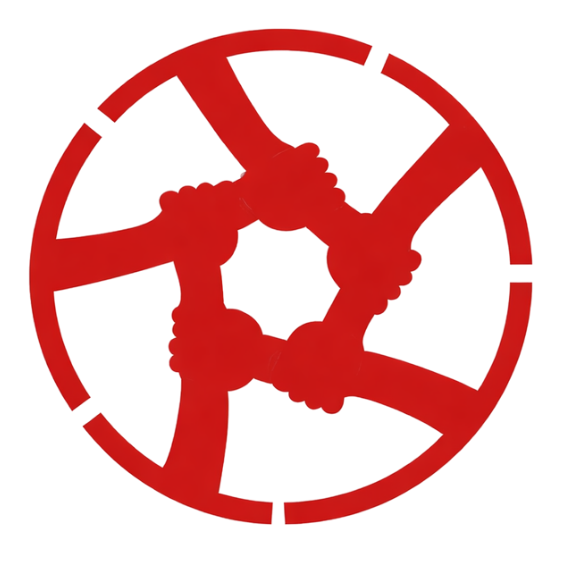

 
O Projeto Resgate de Vidas é uma organização social nascida em junho de 2020, a partir de uma ação de compaixão que se transformou em missão. Durante um dia comum, membros da igreja AD Verbo Vivo se depararam com uma cena marcante: uma criança em situação de extrema vulnerabilidade, tentando “cozinhar” pedras em uma churrasqueira improvisada com tijolos e galhos. Diante daquela realidade, ficou claro que não era possível permanecer indiferente. Foi assim que surgiu o projeto, com o propósito de levar esperança, dignidade e transformação de vida.

A ONG atua nas áreas de **evangelização, alimentação e educação**, atendendo atualmente cerca de 260 crianças cadastradas, com uma média diária de 40 a 80 atendimentos. O público atendido tem entre 2 e 14 anos, e as atividades acontecem todos os dias, de segunda a domingo, das 09h30 às 15h30.

Além de cuidar das crianças, o projeto também oferece suporte às famílias, incluindo acompanhamento psicológico. A igreja Assembleia de Deus Ministério Verbo Vivo, onde o projeto nasceu, contribui com o suporte espiritual, fortalecendo valores e oferecendo दिशा e esperança.

Entre as principais atividades desenvolvidas estão:

* Reforço escolar
* Ensino bíblico
* Intervenção neuropsicopedagógica
* Brincadeiras, esporte e lazer

Datas especiais como Páscoa e Natal são celebradas com muito carinho, proporcionando momentos únicos e inesquecíveis para as crianças.

Um dos relatos mais impactantes vividos no projeto foi o de uma criança de apenas 7 anos que atuava como “olheiro” em um ponto de tráfico na comunidade, em troca de uma marmita. Ao passar a frequentar o projeto, ela declarou que não precisaria mais se envolver com aquilo, pois agora tinha um lugar onde poderia se alimentar. Esse tipo de transformação reforça o propósito e a importância do trabalho realizado.

Atualmente, o projeto conta com 8 voluntários dedicados e não recebe apoio governamental, sendo mantido exclusivamente por doações de pessoas solidárias. São aceitas contribuições como alimentos, roupas, materiais escolares e outros itens essenciais.

O trabalho é conduzido com total transparência, possuindo autorizações para uso de imagem e para atendimentos psicológicos, sem restrições quanto à divulgação das atividades.

Mais do que uma ação social, o Projeto Resgate de Vidas é um chamado à transformação de gerações. A proposta é que cada pessoa que conheça essa iniciativa sinta que também pode fazer parte dessa missão, contribuindo para mudar histórias e construir um futuro melhor.

📍 Endereço: Rua Claudionor Belarminio Ferreira, 330 – Vila Mazzei
Itapetininga/SP – CEP 18209-510

📞 WhatsApp: (15) 98815-3462
📧 E-mail: [resgatedevidasbr@gmail.com](mailto:resgatedevidasbr@gmail.com)

💛 Doações (Pix): [resgatedevidasbr@gmail.com](mailto:resgatedevidasbr@gmail.com)

🌎 Apoio internacional:
Bright Future Foundation (EUA)
Zelle: +1 (415) 299-7545

Se envolver com o Projeto Resgate de Vidas é mais do que ajudar — é participar ativamente da transformação de vidas.
